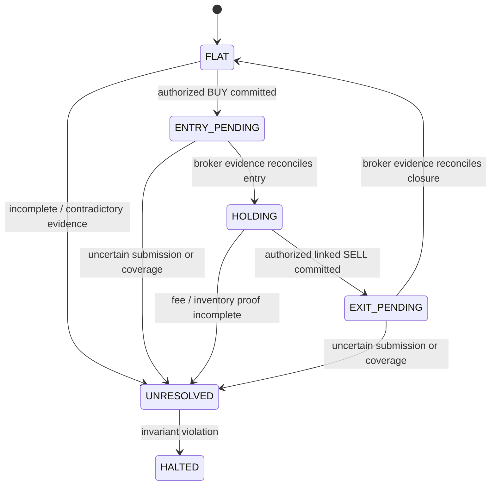

# SHAD0W

**Deterministic trading research and bounded PAPER execution infrastructure built around causal evidence, durable broker state, and fail-closed authority.**

SHAD0W is an experimental quantitative research system for asking a harder question than “did the backtest make money?”:

> **Can the system reconstruct exactly what was known, why a decision was legal, what execution evidence existed, and what remained uncertain?**

The repository combines deterministic historical research with a deliberately constrained Alpaca PAPER integration. It is designed to preserve chronology, evidence provenance, execution state, and negative results rather than silently converting missing information into trading authority.

> [!IMPORTANT]
> SHAD0W does **not** support live-capital trading. The current BTC path is bounded to one PAPER entry and one linked exit per session. Continuous repeated trading is not implemented, and no strategy in this repository is claimed to be profitable or validated.

See [docs/STATUS.md](docs/STATUS.md) for the canonical current capability snapshot.

---

## Current capabilities

| Area | Current state |
| --- | --- |
| Deterministic market-data contracts | Implemented |
| Deterministic feature and strategy evidence | Implemented |
| Chronological simulation and execution economics | Implemented |
| Manifest-bound historical evaluation | Implemented |
| Sealed temporal study evidence | Implemented |
| Independent deterministic risk authority | Implemented |
| Live Alpaca market-data shadowing | Implemented |
| BTC/USD raw history + local live relay | Implemented |
| BTC trend/momentum/volatility strategy candidate | Implemented, unvalidated |
| BTC PAPER preflight and guarded dispatch | Implemented |
| Bounded BTC PAPER strategy session | Implemented |
| Broker-authoritative reconciliation reducer | Implemented for the bounded path |
| Real-provider automatic BTC exit proof | Incomplete |
| Continuous repeated PAPER trading | Not implemented |
| Live-capital trading | Not implemented |

The current BTC session can consume historical context, wait for newly completed live hourly intervals, record abstentions, evaluate independent risk, and submit at most one PAPER BUY plus one linked SELL. Alpaca crypto fee linkage/finality remains insufficient for SHAD0W's strict proof requirements, so a real-provider exit can fail closed even after an accepted entry.

---

## Architecture

SHAD0W has two related but distinct lanes: deterministic research and bounded PAPER operation.

```mermaid
flowchart LR
    subgraph R["Deterministic research"]
        HD["Historical / frozen data"] --> DV["Validation + provenance"]
        DV --> FE["Deterministic features"]
        FE --> ST["Explicit strategy hypotheses"]
        ST --> CS["Chronological simulation"]
        CS --> EE["Execution economics"]
        EE --> EV["Evaluation + evidence"]
    end

    subgraph P["Bounded BTC PAPER path"]
        AM["Alpaca crypto market data"] --> LR["Local crypto relay"]
        LR --> ME["Hash-chained market evidence"]
        ME --> BF["Hourly BTC features"]
        BF --> BP["Strategy proposal / abstention"]
        BP --> BR["Independent BTC risk"]
        BR --> JD["Durable journal + dispatch guard"]
        JD --> AP["Alpaca PAPER"]
        AP --> BE["Orders / fills / fees / positions"]
        BE --> RC["Strict reconciliation"]
        RC --> OL["Operational lifecycle"]
        OL --> BP
    end

    DV -. shared typed contracts .-> ME
    EV -. no trading authority .-> BR
```



The authority boundary is intentionally asymmetric:

```text
market data establishes observations
features establish deterministic measurements
strategy proposes
risk authorizes or rejects
journal commits intent before external effect
broker evidence establishes operational truth
reconciliation determines lifecycle state
evaluation judges evidence; it never grants trading authority
```

### BTC PAPER lifecycle



A new journal, restart, timeout, or operator preference cannot manufacture a flat account. Missing evidence blocks authority.

---

## Design principles

### Causality is part of correctness

SHAD0W distinguishes observation time from availability time. A decision may consume only evidence that was legally available at that modeled instant. Completed-bar signals cannot retroactively execute at the same close that generated them.

### Determinism before optimization

Given the same validated inputs, configuration, implementation identity, and explicit seed where applicable, research output should reproduce exactly. Future observations must not rewrite established historical evidence.

### Provider-neutral core

Strategies, features, simulation, risk, and reconciliation operate on typed SHAD0W contracts. Provider HTTP payloads and SDK-specific values are translated at adapter boundaries.

### Fail closed

Malformed, stale, contradictory, incomplete, future, or unsupported critical evidence becomes an explicit rejection, unresolved state, or halt. It does not become a guessed fill, synthetic flat position, retry, or implicit authorization.

### Evidence before performance claims

A profitable backtest is not treated as proof of an edge. The project preserves assumptions, chronology, costs, incomplete positions, failed experiments, and study partitions so results can be independently challenged.

---

## BTC strategy candidate

The bounded BTC PAPER path currently uses a deterministic long/cash trend candidate over completed hourly BTC/USD intervals. Its engineering configuration combines:

- a trailing baseline;
- short-horizon momentum;
- volatility limits;
- an explicit modeled round-trip cost hurdle;
- high-water reconstruction for lifecycle-backed exits.

The strategy records both signals and abstentions. A missing signal is evidence, not an error.

This configuration is an engineering canary, **not** a validated trading edge.

See [docs/BTC_TREND_PAPER_CONTRACT.md](docs/BTC_TREND_PAPER_CONTRACT.md) and [docs/BTC_PAPER_SESSION.md](docs/BTC_PAPER_SESSION.md).

---

## Run locally

Requirements and package metadata are defined in `pyproject.toml`. The repository uses `uv` for the documented development workflow.

```bash
uv sync
uv run pytest -q
uv run ruff check .
uv run ruff format --check .
uv run mypy src tests
```

### Read-only BTC PAPER preflight

A preflight performs broker reads and reconciliation checks without submitting an order.

```bash
uv run shadow-crypto-paper --preflight --help
```

### Local BTC market-data relay

```bash
uv run shadow-crypto-feed-relay
```

### Bounded BTC PAPER session

```bash
uv run shadow-btc-paper-session --help
```

The session requires explicit PAPER credentials, account binding, unique journal identity, a kill-switch path, and explicit trading acknowledgement. Use the operator contract rather than copying stale commands from old evidence notes:

- [BTC PAPER session](docs/BTC_PAPER_SESSION.md)
- [Current implementation status](docs/STATUS.md)

---

## Repository map

```text
src/shadow/
├── adapters/       provider integrations and normalization
├── application/    bounded composition / CLI entry points
├── data/           validation and dataset identity
├── domain/         provider-neutral value contracts
├── evaluation/     historical reconstruction and study evidence
├── execution/      journal, broker evidence, reconciliation, dispatch
├── features/       deterministic quantitative features
├── risk/           independent authorization boundaries
├── simulation/     chronology and simulated lifecycle
└── strategies/     explicit falsifiable hypotheses

docs/
├── STATUS.md
├── ARCHITECTURE.md
├── RISK_MODEL.md
├── PROJECT_STRATEGY_AND_ENGINEERING_ROADMAP.md
├── BTC_TREND_PAPER_CONTRACT.md
├── BTC_EXECUTION_SEAM.md
├── BTC_PAPER_SESSION.md
├── P5A_EXECUTION_CONTRACT.md
├── P5A_EXECUTION_PLAN.md
└── decisions/
```

---

## Documentation hierarchy

When documents disagree, use this order:

1. **Code and executable tests** — actual behavior.
2. **[docs/STATUS.md](docs/STATUS.md)** — canonical current capability snapshot.
3. **[docs/ARCHITECTURE.md](docs/ARCHITECTURE.md)** — current component and authority boundaries.
4. **Current contracts and runbooks** — bounded behavior for a specific subsystem.
5. **Roadmaps, ADRs, dated reviews, and evidence notes** — plans or historical context, not current-state authority.

This distinction matters because SHAD0W deliberately preserves old design and experiment evidence instead of rewriting history.

---

## Explicit non-goals

SHAD0W currently does not claim or provide:

- a validated or profitable strategy;
- continuous repeated PAPER trading;
- automatic recovery or retry after an uncertain broker submission;
- proof-grade Alpaca crypto fee linkage/finality;
- automatic liquidation at timeout or shutdown;
- live-capital endpoints or trading support;
- portfolio optimization or dynamic leverage;
- an LLM with execution authority.

The project is intentionally conservative: automation is added only when the evidence contract can support it.
