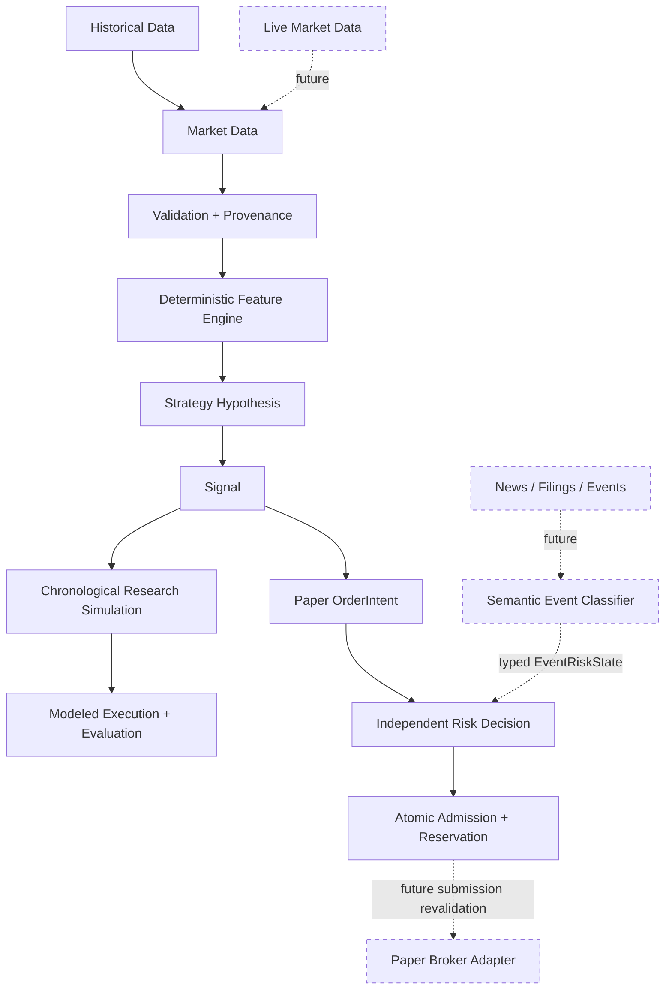
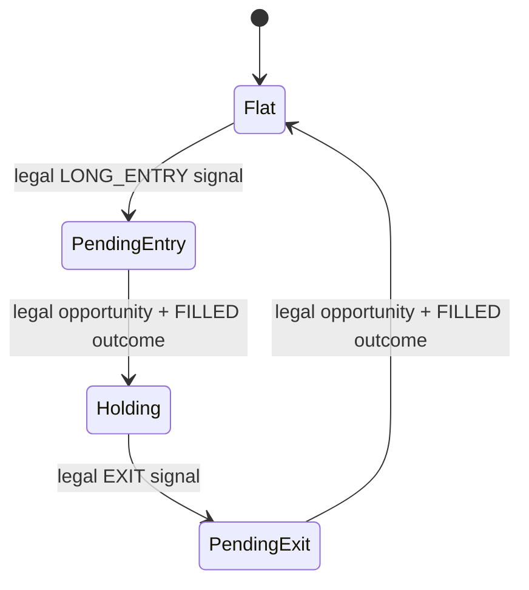

# SHAD0W

**A deterministic quantitative research system for testing whether trading hypotheses survive time, execution constraints, costs, and out-of-sample evaluation.**

SHAD0W is an experimental quantitative research platform built around a simple rule:

> **Do not trust a trading edge until the system can reconstruct exactly why it appeared.**

The project is designed to move from raw market observations to reproducible strategy evidence while explicitly modeling information availability, signal causality, execution timing, lifecycle state, transaction friction, and eventually independent risk controls.

SHAD0W is currently a **research simulator under active development**. It does not submit live orders, connect to a broker, or claim that its initial strategy is profitable.

---

## Why SHAD0W exists

Many backtests can look profitable while quietly relying on unrealistic assumptions:

* future information leaking into historical decisions;
* completed-bar signals filling at the same close that generated them;
* missing or malformed market data being silently repaired;
* indicators changing when future observations are appended;
* duplicate signals creating unintended positions;
* fills occurring without realistic execution constraints;
* transaction costs being ignored;
* parameters being selected on the same data used to report results.

SHAD0W is being built to make those failure modes difficult to express.

The intended research sequence is:

```text
prove the data
    ↓
prove the features
    ↓
specify the hypothesis
    ↓
prove chronological execution
    ↓
model realistic friction
    ↓
evaluate out of sample
    ↓
add independent risk authority
    ↓
connect to live data
    ↓
paper trade
```

Automation comes after evidence.

---

## Current status

**Current milestone: P2A deterministic paper risk authority and P4A Alpaca live-data shadow complete**

**P5A Alpaca paper execution remains separately gated and is not part of P4A.**

Implemented so far:

| Layer                          | Status           | What exists                                                                                           |
| ------------------------------ | ---------------- | ----------------------------------------------------------------------------------------------------- |
| Repository / research contract | ✅ Complete       | Scientific method, architectural boundaries, agent operating rules                                    |
| Market-data contracts          | ✅ Complete       | Typed bars/quotes, provenance, UTC availability semantics, validation, deterministic dataset identity |
| Feature kernel                 | ✅ Complete       | Returns, rolling mean, population variance/std, z-score, explicit warm-up and unavailability states   |
| Initial hypothesis             | ✅ Complete       | Deterministic close-z-score mean-reversion signal contract                                            |
| Timeline semantics             | ✅ Complete       | Deterministic causal event ordering and strict anti-look-ahead execution eligibility                  |
| Lifecycle semantics            | ✅ Complete       | Per-instrument state changes only after an explicit successful execution outcome                       |
| Full chronological runner      | ✅ Complete      | Availability-driven composition of data, features, strategy, timeline, lifecycle, and execution       |
| Deterministic fill boundary    | ✅ Complete      | Fresh causal quote-side attempts/outcomes; buy ask, sell bid, explicit unfilled/rejected behavior     |
| Execution economics           | ✅ P0.5 complete  | Quote-side pricing, adverse slippage, fixed declared quantity, and synthetic proportional fee evidence          |
| Evaluation engine              | ✅ P1A complete   | Manifest-bound trade reconstruction, stress classification, and currency-separated descriptive totals |
| Paper risk authority           | ✅ P2A complete   | Deterministic fail-closed decisions, atomic reservations, and one-use dispatch grants                  |
| Live market data               | ✅ P4A complete   | Alpaca IEX/SIP shadow capture, causal translation, deterministic candidates, no order path          |
| Alpaca paper execution         | ⏳ Planned        | Broker adapter behind stable contracts                                                                |
| LLM event intelligence         | ⏳ Research-gated | Semantic event classification with observational authority only                                       |

---

## Architecture



The core authority model is:

```text
data establishes observations
features establish deterministic measurements
strategy proposes
timeline establishes causal legality
lifecycle establishes simulated state
risk authorizes
execution obeys
evaluation judges
```

No LLM, strategy, broker adapter, or execution component may override the independent risk boundary.

---

## Core design principles

### 1. Time is part of correctness

SHAD0W distinguishes:

```text
observation_time
availability_time
decision_time
execution eligibility
execution event time
```

A decision may consume only evidence that is legally available at that modeled instant.

For completed-bar strategies, a signal derived from a bar cannot retroactively execute at the same closing price that was required to generate it.

---

### 2. Determinism before intelligence

Given the same:

* market data;
* dataset identity;
* configuration;
* implementation;
* and explicit seed where applicable;

SHAD0W should reproduce the same research result.

Nondeterministic behavior must be explicit and evidenced.

---

### 3. Provider-neutral core

Core research logic does not depend on:

* Alpaca;
* Pandas objects;
* HTTP responses;
* broker SDK models;
* databases;
* LLM response objects.

External systems must translate into SHAD0W's typed domain contracts at adapter boundaries.

---

### 4. Fail closed

Malformed, stale, unavailable, inconsistent, or incomplete critical evidence must not silently become a trading decision.

Examples include:

* naive timestamps;
* invalid OHLC relationships;
* duplicate observations;
* out-of-order data;
* non-finite numerical values;
* insufficient feature history;
* zero-variance z-scores;
* future feature evidence;
* impossible lifecycle transitions.

---

### 5. Evidence before performance claims

A profitable result is not treated as proof of an edge.

Future evaluation must account for:

* temporal holdouts;
* walk-forward testing;
* parameter stability;
* transaction costs;
* slippage;
* execution latency;
* benchmark comparison;
* ablations;
* multiple-testing risk;
* sample size;
* regime dependence;
* tail concentration.

SHAD0W is designed to preserve failed experiments and negative results as evidence too.

---

## Current research hypothesis

The first strategy is deliberately minimal.

> **Hypothesis:** a sufficiently negative completed-close z-score may be followed by short-horizon mean reversion.

Conceptually:

```text
validated completed bars
        ↓
rolling close statistics
        ↓
z-score
        ↓
z <= configured entry threshold
        ↓
LONG_ENTRY proposal
```

While holding:

```text
z >= configured exit threshold
        ↓
EXIT proposal
```

The strategy does not:

* size positions;
* calculate fills;
* choose a broker;
* authorize risk;
* change its own parameters;
* inspect future data;
* optimize itself;
* claim profitability.

Its thresholds are experimental configuration, not known optimal values.

RSI, Bollinger wrappers, regime classification, news sentiment, and LLM reasoning are intentionally absent from the initial hypothesis until evidence demonstrates that they add value.

---

## Implemented simulation semantics

### Chronological eligibility

Execution eligibility is currently conservative:

```text
execution_event_time > signal_availability_time
```

This prevents a completed-bar signal from executing against the same market event that helped create it.

Equal timestamps are ordered deterministically by explicit causal precedence rather than incidental Python or provider ordering.

---

### Lifecycle

Each instrument has exactly one authoritative simulation lifecycle:



The current lifecycle models state from explicit deterministic execution evidence. P0.5C economics remains downstream and cannot affect that state.

An eligible opportunity does **not** mean a fill. It creates an attempt only; `unfilled` and `rejected` outcomes leave the action pending. The P0.5A quote model uses only causally available fresh provider-neutral quotes: a long entry buys at ask and an exit sells at bid. A crossed quote is rejected rather than repaired, and no midpoint, close, or later favorable quote is substituted.

Lifecycle and fill eligibility still do **not** model:

* available liquidity;
* market impact or partial fills;
* cash, P&L, return, equity, or performance metrics.

Buying at ask and selling at bid already preserves quoted spread; P0.5A does not subtract a second arbitrary spread charge. P0.5B applies caller-declared adverse slippage after side selection: BUY = ask × (1 + bps / 10000), SELL = bid × (1 - bps / 10000). Zero preserves the original price exactly. Outcomes retain the quote, baseline price, configuration, and modeled price; sensitivity compares caller scenarios in ascending bps order.

P0.5C then attaches one fixed caller-declared quantity per instrument and one explicit synthetic fee in basis points of absolute final executed notional. It derives a cash-flow value for that individual fill only. Quantity is not strategy or risk sizing, quote currency is a research denomination without FX semantics, and fractional units do not imply broker support. Unfilled/rejected outcomes incur no execution fee. No spread or slippage is charged a second time.

Duplicate and impossible actions are deterministic and explicit. Open or pending state remains visible at the end of a simulation stream rather than being silently liquidated.

---

## Project structure

```text
SHAD0W/
├── src/shadow/
│   ├── domain/          # Provider-neutral market contracts
│   ├── data/            # Validation and deterministic dataset identity
│   ├── features/        # Deterministic quantitative features
│   ├── strategies/      # Explicit falsifiable hypotheses
│   ├── simulation/      # Timeline and lifecycle semantics
│   ├── execution/       # Deterministic quote-side execution semantics
│   ├── evaluation/      # Trade reconstruction and descriptive evidence
│   └── risk/            # Paper intents, deterministic decisions, and admission authority
│
├── tests/
│   ├── fixtures/        # Deterministic synthetic market data
│   └── ...              # Behavioral and regression invariants
│
├── docs/
│   ├── ARCHITECTURE.md
│   ├── DATA_CONTRACTS.md
│   ├── EVALUATION.md
│   ├── PROJECT_STRATEGY_AND_ENGINEERING_ROADMAP.md
│   ├── RESEARCH_METHOD.md
│   ├── RISK_MODEL.md
│   └── decisions/       # Architectural decision records
│
├── AGENTS.md            # Repository operating contract
├── pyproject.toml
└── README.md
```

SHAD0W remains a modular monolith. Additional infrastructure is introduced only when a concrete requirement justifies it.

---

## Roadmap

### P0 — Deterministic research foundation

#### P0.0 — Repository operating foundation ✅

Established:

* scientific operating contract;
* source-of-truth hierarchy;
* architectural boundaries;
* reproducibility requirements;
* testing/lint/type-check baseline;
* explicit research methodology.

---

#### P0.1 — Deterministic market-data contracts ✅

Implemented:

* provider-neutral `Bar` and `Quote`;
* instrument and interval contracts;
* provenance;
* dataset metadata;
* explicit observation vs availability time;
* UTC normalization;
* strict malformed-data rejection;
* deterministic canonical serialization;
* SHA-256 dataset identity;
* synthetic fixtures.

---

#### P0.2A — Deterministic feature kernel ✅

Implemented:

* one-period simple returns;
* rolling mean;
* population variance;
* population standard deviation;
* close z-score;
* strict full-window warm-up;
* explicit unavailable states;
* propagated feature availability;
* deterministic Decimal computation;
* prefix-stability tests.

Appending future observations must not change previously produced feature snapshots.

---

#### P0.2B — Strategy-facing composition ✅

No additional indicator framework was required.

The first hypothesis can directly use existing z-score evidence:

```text
price < mean - kσ
```

is representable as:

```text
z_score < -k
```

A redundant Bollinger wrapper, RSI implementation, or generic composition engine was intentionally not added.

---

#### P0.3 — Minimal mean-reversion hypothesis ✅

Implemented:

* immutable strategy configuration;
* provider-neutral strategy signals;
* entry and exit proposals;
* fail-closed feature handling;
* temporal freshness checks;
* reconstructable signal evidence.

This milestone specifies a hypothesis only. It provides no profitability evidence.

---

#### P0.4A — Chronological event semantics ✅

Implemented:

* immutable simulation events;
* deterministic event ordering;
* explicit causal precedence;
* execution-opportunity semantics;
* delayed-availability handling;
* same-bar execution prevention;
* prefix-stable timeline evidence.

---

#### P0.4B — Authoritative simulation lifecycle ✅

Implemented:

```text
flat
→ pending_entry
→ holding
→ pending_exit
→ flat
```

with:

* per-instrument isolation;
* duplicate-signal handling;
* conflict resolution;
* impossible-transition rejection;
* immutable lifecycle evidence;
* unresolved end-state reporting;
* no implicit end-of-data liquidation.

---

#### P0.4C — End-to-end chronological simulator ✅

Implemented as one deterministic, immutable run:

```text
market data
    ↓
features
    ↓
strategy
    ↓
timeline
    ↓
lifecycle
    ↓
SimulationResult
```

The runner uses a validated bar dataset, one mean-reversion configuration per
instrument, explicit price-free opportunities, and an optional run label. The
configuration's z-score window is the only required feature configuration.
It evaluates exactly once per configured instrument/availability instant, using
the newest snapshot where delayed delivery releases multiple historical records
together. It supplies P0.4B's earlier `flat`/`holding` state to P0.3 and
suppresses new action proposals while lifecycle state is pending. The immutable
result preserves dataset fingerprint/configuration identity, feature snapshots,
structured decision outcomes, signals, P0.4A eligibility, and P0.4B state.

P0.4C adds no fill prices, P&L, transaction costs, quantity, liquidity, risk
authorization, or maximum-holding rule. An opportunity remains a structural
lifecycle event rather than a guaranteed real-world fill; pending/open state
remains visible at end of stream. Appending future observations is regression-
tested not to rewrite established historical evidence.

---

#### P0.5A — Deterministic execution and fill semantics ✅

Implemented:

* immutable attempt and outcome evidence with `filled`, `unfilled`, and `rejected` status;
* explicit quote-model identity and immutable freshness configuration;
* causal selection of the newest available matching quote;
* market-age freshness using attempt time minus quote observation time;
* long entries at ask and long exits at bid;
* deterministic crossed-quote rejection and missing/delayed/stale unfilled behavior;
* lifecycle transitions only after `filled`;
* prefix-stability regression coverage against future quote look-ahead.

P0.5A introduces no quantity, partial fills, broker behavior, commissions, slippage,
cash, P&L, or metrics.

---

#### P0.5B — Deterministic adverse slippage sensitivity ✅

Implemented one explicit Decimal bps assumption, applied after legal quote-side selection, with exact zero compatibility, immutable price decomposition, and monotonic caller-supplied scenarios. Model `shadow.execution.quote_bid_ask.v2` identifies the changed filled-price semantics. See [numeric and evidence contracts](docs/DATA_CONTRACTS.md#p05b-deterministic-adverse-slippage) and [remaining execution limitations](docs/EVALUATION.md). No profitability evaluation occurred; example bps are not empirical estimates.

---

#### P0.5C — Fixed quantity and fee economics ✅

Implemented a separate immutable economics boundary identified by `shadow.execution.fixed_quantity_fee_bps.v1`. Each configured instrument declares one fixed positive Decimal quantity, quote-currency denomination, and explicit nonnegative synthetic fee in bps. Exactly one `EconomicExecution` is attached to each filled outcome using its final slipped price; unfilled and rejected outcomes produce none. The evidence includes gross notional, fee, and an individual execution cash flow without adding strategy/risk sizing, liquidity, cash/portfolio state, P&L, or `TradeRecord`.

P0.5 is complete under the bounded definition of quote-side executable pricing, deterministic adverse slippage, fixed declared quantity, and proportional fee evidence. This does not establish complete market microstructure realism or a broker fee schedule.

---

### P1 — Evaluation ⏳

#### P1A — Trade reconstruction and historical-evaluation foundation ✅

P1A reconstructs only authoritative, filled entry/exit economic executions into completed long trades. It preserves unresolved lifecycle state rather than manufacturing an end-of-stream close; rejects incomplete, stale, future, mismatched, or internally inconsistent fill evidence; and keeps nonpositive-price trades explicit as stress evidence outside ordinary returns and aggregates. Each evaluation has an immutable manifest covering supplied bar/quote/opportunity evidence, configuration, implementation versions, caller-supplied code revision, and limitations. Ordinary completed trades have gross/net results and returns, while aggregates remain separated by caller-declared quote currency. This is descriptive evidence only: it adds no cash balance, portfolio, compounding, buying power, FX conversion, or claim of edge.

Later P1 work will build the evidence needed to determine whether the hypothesis survives scrutiny:

* development / validation / final-holdout separation;
* chronological walk-forward analysis;
* gross vs net results;
* expectancy;
* win/loss distribution;
* drawdown;
* turnover;
* profit factor;
* cost contribution;
* parameter stability;
* ablation testing;
* benchmark comparison;
* regime-conditioned outcomes;
* explicit limitations and uncertainty.

A profitable backtest remains evidence requiring validation, not proof of a durable edge.

---

### P2A — Minimal deterministic paper risk authority ✅

P2A adds provider-neutral paper market/DAY intents with operator-declared whole-unit quantity; an immutable policy for allowlists, maximum quantity, concurrent positions, and freshness; explicit complete inventory/order/control state; and deterministic entry/full-exit decisions. A process-local gate makes the first decision for a business identity authoritative, reserves instrument and capacity before returning a one-use dispatch grant, rejects exact duplicates, and treats changed content under one identity as conflict.

```text
signal proposes
risk authorizes or rejects
gate admits and reserves once
one application claim records consumption
future broker requires submission-time revalidation
```

P2A has no live data, broker connection, external submission, persistence, restart reconciliation, cash, buying power, P&L, portfolio accounting, or live-capital authority. Disabled trading and the kill switch freeze new entry and exit admissions for this milestone; they are not a liquidation mechanism and do not revoke existing claims.

The claim proves admission-time authorization only: it has no expiry and does not revalidate later controls, policy, or freshness. Reservations never release, including after claim or a reported fill. P2A cannot support external submission or a continuous entry/fill/exit cycle. See [the risk model](docs/RISK_MODEL.md) for these bounded guarantees and [the adversarial closure](docs/P2A_SAFETY_REVIEW.md) for review evidence.

---

### P3 — Deterministic regime classification (deferred) ⏳

Evaluate whether measurable market-state information improves the baseline.

Potential deterministic inputs include:

* benchmark return;
* volatility;
* market breadth;
* rolling correlation;
* dispersion;
* residual movement;
* liquidity.

Possible states may include:

```text
NORMAL
HIGH_VOLATILITY
SYSTEMIC_STRESS
STALE_OR_INVALID
```

The regime layer will be retained only if out-of-sample evidence demonstrates value.

---

### P4A — Alpaca live-data shadow ✅

P4A adds a bounded, market-data-only Alpaca stock-stream command. It subscribes to explicit IEX/SIP symbols, translates provider JSON immediately into existing provider-neutral `Bar`/`Quote` values, converts minute-bar left-edge timestamps to SHAD0W interval ends, and uses application receipt as availability evidence. `shadow.live.v1` retains structured JSONL normalized market/control evidence that can be strictly reloaded and deterministically recomputed against persisted derived evidence. Terminal `stopped`/`failed` captures are complete; a valid interrupted prefix is explicitly incomplete, while corrupt interior evidence fails closed.

Completed bars independently drive the existing feature and mean-reversion candidate pipeline per symbol from `PositionState.FLAT` only. P4A is live flat-state candidate observation: it can observe entry candidates but neither infers a broker holding nor generates lifecycle-backed exits. Quotes are not required to accumulate bars; a current quote is required only to make a candidate's risk inputs ready. Since P4A has no account adapter, a live candidate reports unavailable broker-authoritative operational state rather than pretending inventory is flat. Offline tests may use pure risk evaluation over explicitly supplied non-authoritative state; P4A never uses risk admission, creates an authorization, or reaches an execution interface.

Run a bounded session after setting the documented credentials as process-environment variables. `.env.example` documents their names only; the application does not load `.env` automatically:

```powershell
shadow-live-data --session-id example-2025-01-02 --code-revision <commit> --symbol AAPL --feed iex --duration-seconds 60 --evidence-path .\shadow-aapl.jsonl
```

The command prints `SHADOW MODE — NO ORDER SUBMISSION`. It contains no Alpaca trading client, account endpoint, submit/cancel/replace operation, or broker state claim.

---

### P5A — Alpaca paper execution ⏳

Introduce the first broker adapter.

Paper execution must handle:

* broker-authoritative state;
* rejected orders;
* partial fills;
* late fills;
* disconnects;
* retries;
* duplicate submissions;
* restart/reconciliation behavior.

Broker SDK types remain outside SHAD0W's core domain.

---

### P6 — Semantic event-risk intelligence ⏳

Only after the deterministic system is measurable:

```text
news / filings / events
        ↓
normalization + deduplication
        ↓
semantic classifier
        ↓
typed EventRiskState
        ↓
deterministic risk engine
```

LLM output has observational authority only.

It may classify unstructured events.

It may never:

* place orders;
* size positions;
* change risk limits;
* alter strategy parameters;
* bypass deterministic vetoes;
* judge its own profitability.

The component must survive ablation testing or be removed.

---

### P7 — Execution-quality and signal-decay research ⏳

Study whether the remaining edge survives realistic execution:

* market vs limit behavior;
* fill probability;
* adverse selection;
* spread;
* slippage;
* latency sensitivity;
* signal half-life.

---

### P8 — Additional strategy research ⏳

Additional hypotheses are introduced only after the platform can reliably invalidate them.

The goal is not to accumulate indicators.

The goal is to test ideas efficiently and reject weak ones.

---

### P9 — Future live-capital gate ⏳

Live capital remains outside the current project milestone.

A future live gate would require explicit evidence for:

* historical robustness;
* untouched holdout behavior;
* walk-forward stability;
* realistic cost sensitivity;
* shadow-mode reliability;
* paper-execution reconciliation;
* tail-risk controls;
* failure recovery;
* operational monitoring;
* capital-at-risk limits.

Passing earlier phases does not automatically authorize live trading.

---

## Research and correctness invariants

The project treats these as engineering requirements:

### Reproducibility

```text
same data
+ same configuration
+ same implementation
+ same explicit seed
= same result
```

unless nondeterminism is explicitly documented.

### Prefix stability

Appending future observations must not alter already-established historical feature or simulation evidence.

### Causality

Information cannot affect a decision before its availability time.

### No silent repair

Invalid critical data must not be sorted, deduplicated, interpolated, forward-filled, or otherwise repaired without explicit normalization evidence.

### No hidden strategy mutation

Strategy parameters and logic cannot change during an experiment without changing experiment identity.

### Separation of authority

```text
Strategy   → proposes
Timeline   → establishes causal legality
Lifecycle  → owns simulated state
Risk       → authorizes
Execution  → executes
Evaluation → judges
```

---

## Development

### Requirements

* Python 3.12+
* [`uv`](https://docs.astral.sh/uv/)

Install the development environment:

```powershell
uv sync --group dev
```

Run the canonical checks:

```powershell
uv run pytest
uv run ruff check .
uv run ruff format --check .
uv run mypy src tests
git diff --check
```

> **Windows note:** some local environments have exhibited a `uv` script-trampoline canonicalization issue for direct console-script invocation. During affected runs, equivalent `.venv\Scripts\python.exe -m ...` commands are used to distinguish environment-wrapper failures from project failures.

---

## Documentation

The README is the project overview. The detailed contracts live in `docs/`.

| Document                                                                                               | Purpose                                                         |
| ------------------------------------------------------------------------------------------------------ | --------------------------------------------------------------- |
| [`AGENTS.md`](AGENTS.md)                                                                               | Engineering-agent operating contract and source precedence      |
| [`docs/ARCHITECTURE.md`](docs/ARCHITECTURE.md)                                                         | Component boundaries and implemented architecture               |
| [`docs/DATA_CONTRACTS.md`](docs/DATA_CONTRACTS.md)                                                     | Market, feature, strategy, and simulation contracts             |
| [`docs/RESEARCH_METHOD.md`](docs/RESEARCH_METHOD.md)                                                   | Scientific method, temporal discipline, and falsification rules |
| [`docs/EVALUATION.md`](docs/EVALUATION.md)                                                             | Evaluation philosophy and planned evidence                      |
| [`docs/RISK_MODEL.md`](docs/RISK_MODEL.md)                                                             | Independent risk authority and future controls                  |
| [`docs/PROJECT_STRATEGY_AND_ENGINEERING_ROADMAP.md`](docs/PROJECT_STRATEGY_AND_ENGINEERING_ROADMAP.md) | Canonical execution roadmap                                     |
| [`docs/decisions/`](docs/decisions/)                                                                   | Architectural decision records                                  |

---

## What SHAD0W is not

SHAD0W is not currently:

* a profitable trading system;
* an HFT engine;
* a brokerage platform;
* a portfolio-management service;
* an autonomous LLM trader;
* a live execution system;
* a guarantee of future returns.

It is a research system for determining whether a trading hypothesis deserves to survive increasingly realistic tests.

---

## Development philosophy

```text
hypothesis
    ↓
make assumptions explicit
    ↓
encode them
    ↓
write adversarial tests
    ↓
attempt to falsify
    ↓
measure
    ↓
retain or reject
```

Complexity is earned by evidence.

A new model, indicator, AI component, data source, service, or infrastructure dependency should enter the system only when a concrete experiment demonstrates why it is needed.

---

## Safety and financial disclaimer

SHAD0W is experimental research software.

Nothing in this repository constitutes financial advice, investment advice, or a representation that any strategy will be profitable.

The current system does not submit live trades.

---

## License

No license has been selected.

Until a license is explicitly added, external reuse, modification, distribution, and contribution rights are not granted.
