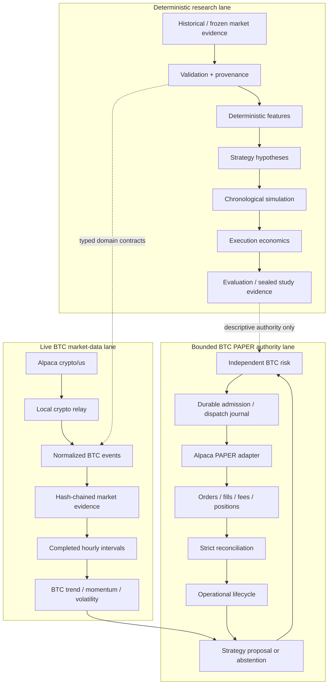
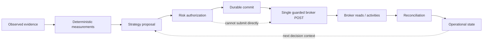
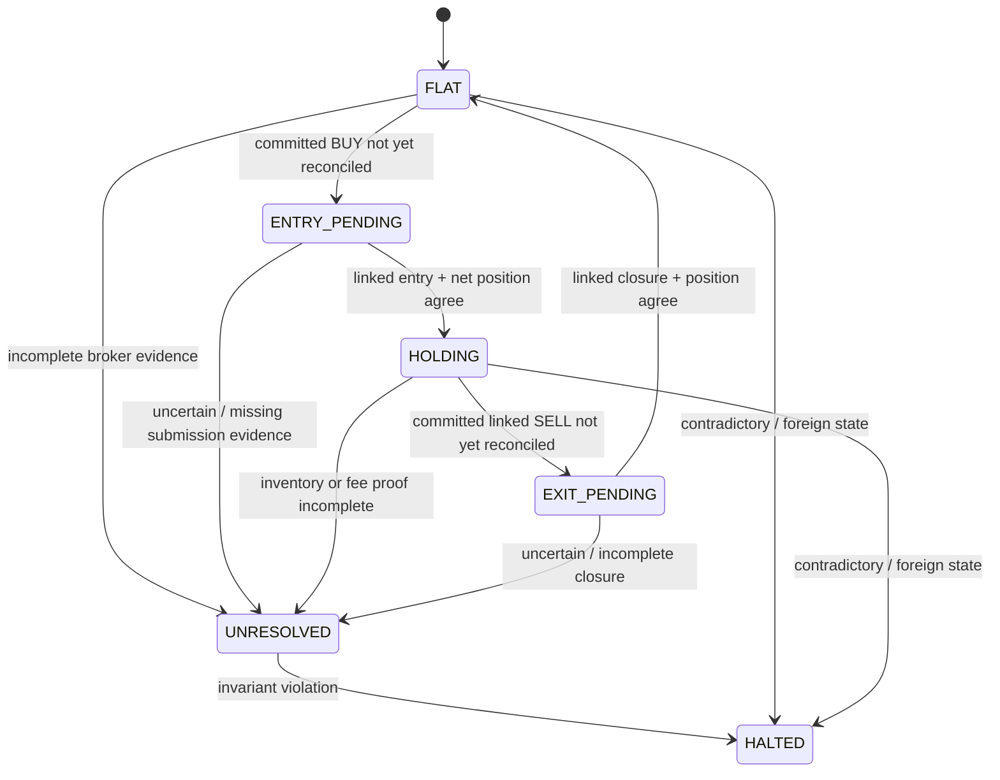

# Architecture

SHAD0W is a Python modular monolith with explicit typed boundaries between research evidence, trading proposals, risk authority, durable execution state, provider adapters, and evaluation.

The architecture is optimized for reconstructability before throughput: an external effect should be explainable from immutable evidence, and missing or contradictory evidence should reduce authority rather than increase it.

For the current implementation snapshot, see [STATUS.md](STATUS.md).

## System shape

Research evaluation cannot authorize a broker submission. Strategy cannot bypass risk. Risk cannot manufacture broker state. Broker responses do not become operational truth until normalized evidence is reconciled against the durable journal.

## Authority flow

The durable commit precedes the external POST. An uncertain outcome is not retried automatically. Deterministic client IDs aid recovery and identity; they do not create authority to send again.

## Operational lifecycle

The bounded BTC path uses broker evidence to project one of six states:

`UNRESOLVED` preserves uncertainty. `HALTED` represents a condition that must not grant new dispatch authority.

## Core modules

| Area | Responsibility |
| --- | --- |
| `domain` | Provider-neutral market and evidence value types |
| `data` | Validation, deterministic identity, frozen data boundaries |
| `features` | Deterministic calculations and availability propagation |
| `strategies` | Explicit hypotheses; proposal authority only |
| `simulation` | Chronological eligibility and simulated lifecycle |
| `evaluation` | Trade reconstruction, descriptive metrics, study evidence |
| `risk` | Independent authorization/rejection boundaries |
| `execution` | Broker contracts, journal, reconciliation, dispatch |
| `adapters` | Alpaca and other external translations |
| `application` | Bounded composition and CLI entry points |
| `operations` | Read-only operational/timing evidence utilities |

Provider SDK objects, HTTP payloads, dataframe types, and LLM response objects do not cross into the provider-neutral core.

## Time and causality

SHAD0W models at least:

- observation time — when the market event occurred;
- availability time — when the system could legally consume it;
- decision time — when strategy/risk evaluation occurred;
- dispatch deadline — latest legal external-effect boundary;
- broker evidence observation/availability — when operational facts were observed and usable.

A later receipt cannot make an earlier observation causally newer. A completed interval cannot be used before it exists. Provider timestamps that appear to be in the future relative to system receipt fail closed; no tolerance is silently added to preserve a trade.

## Market evidence

The BTC path separates:

1. bounded historical raw trades for warm start;
2. newly observed live trades/quotes from the local relay;
3. reconstructed completed hourly intervals;
4. deterministic strategy features;
5. durable decision/abstention evidence.

Historical context can establish features but cannot by itself trigger a fresh entry. The current partially captured interval is not actionable.

## Journal and ownership

The execution journal is SQLite-backed and account/scope bound. Local account ownership is bound to one journal path so a fresh empty journal cannot be used to erase unresolved execution history.

Important properties:

- account identity and operational scope are immutable;
- committed attempts are durable;
- client-order identity is deterministic;
- submission and reconciliation are explicit transitions;
- one account owner is permitted within the supported local deployment boundary;
- restart replays/reconciles rather than resetting authority;
- journal loss, replacement, or conflicting identity fails closed.

The local lock is an operational single-host guard, not distributed or hostile-process security.

## Reconciliation

Broker truth is reconstructed from typed account, asset, order, fill/activity, and position evidence.

The reducer does not assume:

- acceptance means filled;
- a position snapshot proves order history;
- absence from one open-orders response proves a submission never occurred;
- gross fill quantity equals net crypto inventory after fees;
- elapsed time resolves uncertainty;
- a deterministic client ID permits retry.

The bounded BTC session additionally requires explicit available BTC to match reconciled net exposure before a SELL can be authorized.

## Research vs operational state

SHAD0W contains two lifecycle concepts and they must not be conflated:

- **simulation lifecycle** — deterministic research state derived from simulated execution outcomes;
- **operational lifecycle** — broker-authoritative state derived from durable attempts and real PAPER evidence.

Research results cannot be imported as broker state. Operational state cannot rewrite historical research evidence.

## Deliberate non-requirements

The current system does not require Kafka, Redis, Celery, Kubernetes, microservices, a distributed database, or a web frontend. Additional infrastructure should be introduced only when a measured deployment requirement justifies it.

Likewise, SHAD0W does not currently implement live-capital support, continuous repeated trading, dynamic leverage, portfolio optimization, or LLM execution authority.
