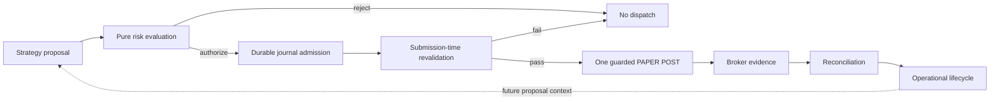

# Risk model

SHAD0W treats strategy output as a proposal, never as submission authority.

The current repository contains two related risk boundaries:

1. the original provider-neutral P2A paper-risk gate used to prove deterministic authorization/admission semantics;
2. the BTC-specific risk and durable dispatch path used by the bounded BTC PAPER experiment/session.

See [STATUS.md](STATUS.md) for current implementation coverage.

## Authority chain

No historical risk decision, signal, reconstructed token, client ID, or broker acceptance message is sufficient by itself to authorize another external effect.

## P2A deterministic paper authority

P2A establishes the original independent authorization model:

- immutable versioned policy;
- explicit operator controls;
- causal feature/signal/quote validation;
- inventory/order completeness requirements;
- deterministic duplicate identity;
- first-decision authority for one business opportunity;
- atomic reservation before grant exposure;
- one-use process-local claim.

P2A is intentionally not restart-safe broker authority. Its gate-local grant is evidence of authorization at admission time, not a durable permission to submit later.

This boundary remains useful as a pure risk model and regression target.

## BTC-specific risk evaluation

The bounded BTC path adds a separate policy appropriate to fractional BTC/USD PAPER execution.

It re-evaluates:

- account binding and eligibility;
- BTC asset tradability;
- configured quantity and provider quantity constraints;
- maximum entry notional;
- cash buffer;
- market evidence freshness;
- strategy configuration identity;
- broker snapshot/activity coverage;
- lifecycle state;
- existing attempts;
- operator controls;
- available quantity for exits.

The strategy does not dynamically size the position. Quantity is operator-supplied and then independently checked.

## Entry authority

A bounded strategy entry requires, at minimum:

- reconciled initial-flat account state;
- usable journal/ownership authority;
- no unresolved prior attempt;
- fresh market evidence;
- a valid entry proposal from the frozen strategy configuration;
- current broker account/asset evidence;
- quantity legal under provider and policy constraints;
- notional and cash-buffer checks;
- trading enabled;
- kill switch inactive;
- a fresh submission deadline.

A `NO_SIGNAL` decision is normal and is persisted as evidence.

## Exit authority

A linked SELL is intentionally stricter.

It requires:

- a journal-linked prior entry;
- reconciled `HOLDING` state;
- execution/fill history sufficient to reconstruct exposure;
- current broker position agreement;
- explicit broker available BTC equal to reconciled net exposure;
- legal quantity grid;
- fresh strategy/risk evidence;
- unchanged bounded session authority.

Gross BUY fill quantity is not substituted for net available crypto.

## Fee finality blocker

Crypto fees can change net BTC inventory after an accepted BUY. SHAD0W therefore requires evidence strong enough to establish the quantity that can safely be submitted on the linked SELL.

Current Alpaca activity evidence does not provide the proof-grade fee linkage/finality semantics required by the strict reducer. As a result:

- a BUY can be accepted and reconciled to net exposure;
- the system may still refuse the SELL;
- the session may end unresolved;
- manual PAPER cleanup may be required by the operator.

This limitation must not be “fixed” by:

- using gross fill quantity;
- assuming `qty_available` proves fee finality by itself;
- rounding an exit upward;
- creating a new journal to bypass unresolved state;
- retrying a possibly accepted order;
- weakening timestamp or activity coverage checks.

## Durable dispatch

The bounded dispatch path adds guarantees that P2A alone does not provide:

- stable account/scope binding;
- deterministic client-order identity;
- journal-before-POST ordering;
- one POST per committed attempt;
- bounded dispatch deadline;
- submission-time broker/risk/control revalidation;
- persistent uncertain outcomes;
- restart reconciliation;
- no automatic retry after uncertainty.

Deterministic client IDs support lookup and duplicate reasoning. They never grant permission to resend.

## Controls

Trading authority depends on explicit operator controls.

The current session supports:

- explicit `--trading-enabled`;
- PAPER-only endpoint validation;
- explicit acknowledgement string;
- kill-switch file observation;
- bounded session deadline.

The kill switch freezes automation. It does not imply automatic liquidation.

## Fail-closed conditions

Examples include:

- stale/future market evidence;
- account or scope mismatch;
- incomplete inventory/order history;
- unsupported broker activity;
- malformed timestamps;
- uncertain submission;
- contradictory fills/positions;
- unexplained external activity;
- ownership loss;
- journal identity conflict;
- invalid or unavailable exit quantity;
- insufficient fee linkage/finality.

The desired result is explicit rejection, `UNRESOLVED`, or `HALTED` state—not a guessed recovery.

## Current limits

SHAD0W currently does not provide:

- continuous repeated trading;
- automatic retry/recovery of uncertain submissions;
- automatic cancel/replace orchestration;
- forced liquidation at session end;
- proof-grade real-provider BTC exit finality;
- live-capital trading;
- portfolio-level risk optimization;
- strategy-profitability validation.

These limits are operational constraints, not roadmap marketing.
